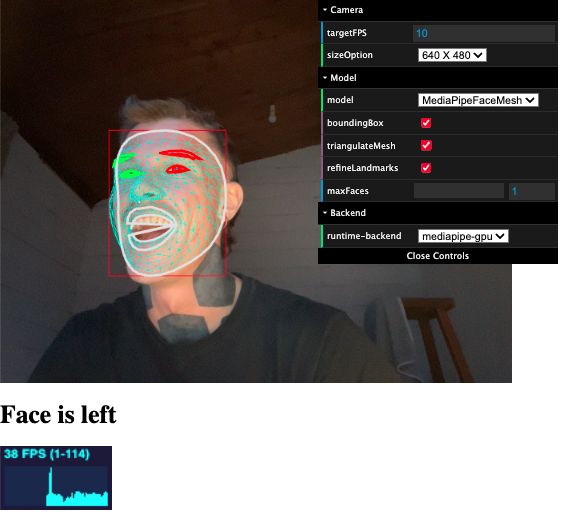

# Face Detection Trigger

You wanna control your music-playlist with your face? 
Or plan to send a message to your mum if you are not smiling enough?
This is the right place for you!

## Run the frontend
1. Clone this repository  
`git clone git@github.com:spielhoelle/face-detection-trigger.git`
2. Install the requirements  
`npm install`
3. Run the script  
`npm run dev`

## Run the API
1. cd backend
2. pip install -r requirements.txt
3. python manage.py migrate
4. python manage.py runserver

## Usage
- Open the [frontend](http://localhost:1234) in your browser 
- If you move your face to the left the browser triggers and sends a POST request to the django backend

## TODO
- [Adjust payload like head-left, blink or show tongue](src/index.js)
- [Do something serious in the backend with the payload](backend/faceactions/views.py)